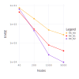

# Numerical Tests

This section is devoted to show, by means of numerical simulations the accuracy of the normal spline method. 

## 2D interpolation case

### Models

To test the accuracy of the normal spline method, we take three test functions defined in the region ``{\Omega = [0, 1]^2}``:

- Franke Exponential function ``f_1`` [1]

```math
\begin{aligned}
f_1(x,y) =& \ 0.75*\exp(-((9*x - 2)^2 + (9*y - 2)^2)/4) +
\\
& \ 0.75*\exp(-((9*x + 1)^2)/49 - (9*y + 1)/10) \, +
\\
& \ 0.5*\exp(-((9*x - 7)^2 + (9*y - 3)^2)/4) - 0.2*\exp(-(9*x - 4)^2 - (9*y - 7)^2)
\end{aligned}
```
```@raw html

```  ```@raw html

```

- Franke Cliff function ``f_2`` [1]

```math
    f_2 (x,y) = \frac{\tanh(9*(y - x)) + 1}{\tanh(9)+ 1} \qquad\qquad\qquad\qquad\qquad\qquad\qquad\qquad \qquad\qquad\qquad\qquad\qquad\qquad\qquad\quad
```
```@raw html

```  ```@raw html

```

- Franke and Nielson "faults and creases" model ``f_3`` [2] 

```math
f_3 (x,y) = \begin{cases}
            0.5 \, ,  \qquad\qquad\qquad\qquad\qquad\qquad\qquad\quad\quad \quad \ \ y \le 0.4  \cr
            0.5*(1 - ((y - 0.4)/0.6)^2)\, ,  \qquad\qquad\qquad\quad \  x \le 0.1 \, , \ y \gt 0.4  \cr
            0.5*((y - 1)/0.6)^2 * (1 - x) / 0.8 \, ,  \qquad \qquad \ \ \  x \ge 0.2 \, , \ y \gt 0.4  \cr
            5*(((y - 1)/0.6)^2 * (x - 0.1) + \cr
             \quad \ \ \ (1 - ((y - 0.4)/0.6)^2) * (0.2 - x))) \, , \qquad  0.1 \lt x \le 0.2 \, , \ y \gt 0.4   \cr
            \end{cases} 
            \quad
```
```@raw html

```  ```@raw html

```

$~$

### Grids

The test functions are sampled on two types of data sets. The first is a Halton data ([3], [4]) and the second is a uniform random nodes on ``\Omega = [0, 1]^2``.

Examples of data sets: 1000 Halton nodes (left) and 1000 uniform random nodes (right).
```@raw html

```  ```@raw html

```

Denote the set of the interpolation nodes as ``\Chi``, ``\Chi = \{x_1, \dots, x_N \} \subset \Omega``. There are two quantities which measure the density of the data set ``\Chi`` ([5], [6]). The first is the *separation distance*

```math
\tag{1}
  q_\Chi = \frac{1}{2} \min_{i \ne k} | x_i - x_k | \ .
```
The second is the *fill distance*

```math
\tag{2}
  h_\Chi = \sup_{x \in \Omega} \min_{x_k \in \Chi} | x - x_k | \ .
```
The separation distance ``q_\Chi`` represents the radius of the largest ball that can be centred at every node in ``\Chi`` such that no two balls overlap. The Gram matrix of the interpolation problem is ill–conditioned if the data locations come close i.e. if the separation distance is small.

The fill distance ``h_\Chi`` denotes the radius of the largest empty ball that can be placed among the data locations. It indicates how well the data fill out the domain ``\Omega``. The error of interpolation is small if ``h_\Chi`` is small.

The distances ``q_\Chi`` and ``h_\Chi`` give an idea of the node distribution, i.e. how uniform data are. A set of data is said to be *quasi-uniform* with respect to a constant ``C_{qu}`` if

```math
\tag{3}
 q_\Chi \le h_\Chi \le C_{qu} q_\Chi  \ .
```
The definition of quasi-uniform points has to be seen in the context of more than one data set. The idea is to consider a sequence of such sets so that the domain ``\Omega`` is more and more filled out. Then, points are said to be quasi-uniform if condition (3) is satisfied by all the sets in this sequence with the same constant ``C_{qu}`` [6].

In order to have a better understanding a difference between Halton and uniform random data distribution we report in Table 1 corresponding values of the fill distance and the separation distance for these data sets. The last column gives an idea of the quasiuniformity constant.

Table 1: Fill and separation distances of different sets of Halton data and uniform random nodes.

|     N     |    Data set   |``\bm {h_\Chi}``|``\bm {q_\Chi}``|``\bm {h_\Chi}`` / ``{\bm q_\Chi}``|
|:---------:|:-------------:|:------------:|:------------:|:---------------------:|
|     40    | Halton        |   2.1e-01    |   4.8e-02    |       4.3e+00         |
|           | random        |   3.1e-01    |   6.3e-03    |       4.9e+01         |
|    200    | Halton        |   9.3e-02    |   3.1e-03    |       3.0e+01         |
|           | random        |   1.3e-01    |   1.8e-03    |       7.5e+01         |
|   1000    | Halton        |   3.9e-02    |   2.8e-03    |       1.4e+01         |
|           | random        |   5.3e-02    |   4.2e-05    |       1.3e+03         |
|   5000    | Halton        |   1.8e-02    |   7.9e-04    |       2.2e+01         |
|           | random        |   3.3e-02    |   4.2e-05    |       7.9e+02         |

$~$

### Results

The normal spline interpolant ``\sigma (x)`` is evaluated on a uniform regular grid ``E_S= \{ \tilde x_i \, , \ i=1, \dots, S \}`` of ``S = 101 × 101`` points in the unit square ``{\Omega = [0, 1]^2}``. 

The interpolation error is measured by means of the Root Mean Square Error (``RMSE``)

```math
\tag{4}
  RMSE = \sqrt { \frac{1}{S} \sum_{i=1}^S |f (\tilde x_i) - \sigma (\tilde x_i) |^2 } \ ,
```
and the Maximum Absolute Error (``MAE``)
```math
\tag{5}
  MAE = \max_{1 \le i \le S} |f (\tilde x_i) - \sigma (\tilde x_i) | \ .
```
We also evaluate an estimation of the 1-norm condition number ``\kappa_1`` of the interpolation problem Gram matrix (this estimation is obtained by the procedure described in [7] and requires ``O(N^2)`` operations), a value of the spectral condition number ``\kappa_2`` of the interpolation problem Gram matrix obtained by means of the matrix SVD decomposition (it requires ``O(N^3)`` operations) and an estimation of number of interpolant 'significant digits' (``SD``) which is calculated as
```math
\tag{6}
SD = -[\log_{10}(\max_{1 \le k \le N} |f (x_k) - \sigma (x_k) |)] - 1 \ ,
```
here ``[\cdot]`` denotes an integer part of number.

Notice, a two-dimensional normal spline built with ```RK_H0``` reproducing kernel is an element of the Bessel potential space ``H^{3/2}_\varepsilon (R^2)``, an element of that space can be treated as a bounded continuous function. Correspondingly, a two-dimensional normal spline built with ```RK_H1``` reproducing kernel is an element of the Bessel potential space ``H^{5/2}_\varepsilon (R^2)``, an element of that space can be treated as a bounded with its derivatives continuously differentiable function, however a normal spline interpolant built with ```RK_H1``` reproducing kernel is a twice continuously differentiable function. Further, a two-dimensional normal spline built with ```RK_H2``` reproducing kernel is an element of the Bessel potential space ``H^{7/2}_\varepsilon (R^2)``, an element of that space can be treated as a bounded with all its derivatives twice continuously differentiable function, however a normal spline interpolant built with ```RK_H2``` reproducing kernel has continuous partial derivatives up to order four. 

#### Tests with Halton data

In this subsection we consider Halton data. Results, obtained by means of the normal spline interpolant with the functions ``f_1``, ``f_2`` and ``f_3``, are shown in Tables 2, Table 3 and Table 4, respectively. Comparison among 'standard' and hermite normal spline interpolation is reported in Table 5 and Table 6. In all these cases the value ``\varepsilon`` of the scaling ('shape') parameter was chosen automatically by a heuristic algorithm.

Table 2: RMSEs and MAEs computed using ``f_1`` as the test function sampled on Halton nodes. 

|     N     | Reproducing kernel  |   RMSE   |      MAE     |    ε      |``\kappa_1``|``\kappa_2``|    SD    |
|:---------:|:-------------------:|:--------:|:------------:|:---------:|:----------:|:----------:|:--------:|
|     40    |     ```RK_H0```     | 3.8e-02  |   1.3e-01    |  1.4e+00  |   1.0e+04  |   1.0e+02  |    15    |
|           |     ```RK_H1```     | 1.9e-02  |   6.1e-02    |  2.0e+00  |   1.0e+06  |   1.0e+04  |    13    |
|           |     ```RK_H2```     | 1.7e-02  |   9.5e-02    |  2.7e+00  |   1.0e+07  |   1.0e+05  |    12    |
|    200    |     ```RK_H0```     | 5.3e-03  |   3.3e-02    |  2.2e+00  |   1.0e+06  |   1.0e+03  |    15    |
|           |     ```RK_H1```     | 1.1e-03  |   1.0e-02    |  3.3e+00  |   1.0e+08  |   1.0e+06  |    13    |
|           |     ```RK_H2```     | 6.0e-04  |   4.2e-03    |  4.4e+00  |   1.0e+10  |   1.0e+08  |    12    |
|   1000    |     ```RK_H0```     | 7.9e-04  |   1.0e-02    |  3.7e+00  |   1.0e+07  |   1.0e+04  |    15    |
|           |     ```RK_H1```     | 1.0e-04  |   1.6e-03    |  5.5e+00  |   1.0e+10  |   1.0e+07  |    14    |
|           |     ```RK_H2```     | 3.0e-05  |   6.4e-04    |  7.4e+00  |   1.0e+12  |   1.0e+09  |    13    |
|   5000    |     ```RK_H0```     | 4.5e-04  |   6.0e-03    |  6.3e+00  |   1.0e+08  |   1.0e+04  |    15    |
|           |     ```RK_H1```     | 4.3e-05  |   6.4e-04    |  9.5e+00  |   1.0e+11  |   1.0e+07  |    14    |
|           |     ```RK_H2```     | 7.4e-06  |   1.6e-04    |  1.3e+01  |   1.0e+13  |   1.0e+09  |    13    |

$~$

Figure 1: The logarithmic scale of the RMSE versus the number of Halton nodes for the spline interpolants of the function ``f_1`` built with reproducing kernel ```RK_H0```, ```RK_H1``` and ```RK_H2```.


Figure 2: The results of function ``f_1`` interpolation (surface, contour map and error surface) obtained with ```RK_H2``` reproducing kernel with 1000 Halton data.
```@raw html

```  ```@raw html

```   ```@raw html

```

$~$

Table 3: RMSEs and MAEs computed using ``f_2`` as the test function sampled on Halton nodes.

|     N     | Reproducing kernel  |   RMSE   |      MAE     |    ε      |``\kappa_1``|``\kappa_2``|    SD    |
|:---------:|:-------------------:|:--------:|:------------:|:---------:|:----------:|:----------:|:--------:|
|     40    |     ```RK_H0```     | 6.8e-02  |   2.4e-01    |  1.4e+00  |   1.0e+04  |   1.0e+02  |    15    |     
|           |     ```RK_H1```     | 5.7e-02  |   2.3e-01    |  2.0e+00  |   1.0e+06  |   1.0e+04  |    13    |
|           |     ```RK_H2```     | 6.0e-02  |   3.1e-01    |  2.7e+00  |   1.0e+07  |   1.0e+05  |    12    |
|    200    |     ```RK_H0```     | 1.2e-02  |   9.4e-02    |  2.2e+00  |   1.0e+06  |   1.0e+03  |    14    |
|           |     ```RK_H1```     | 5.1e-03  |   6.2e-02    |  3.3e+00  |   1.0e+08  |   1.0e+06  |    13    |
|           |     ```RK_H2```     | 5.1e-03  |   4.2e-03    |  4.4e+00  |   1.0e+10  |   1.0e+08  |    11    |
|   1000    |     ```RK_H0```     | 3.6e-03  |   5.7e-02    |  3.7e+00  |   1.0e+07  |   1.0e+04  |    15    |
|           |     ```RK_H1```     | 7.1e-04  |   1.9e-02    |  5.5e+00  |   1.0e+10  |   1.0e+07  |    13    |
|           |     ```RK_H2```     | 2.4e-04  |   7.1e-03    |  7.4e+00  |   1.0e+12  |   1.0e+09  |    12    |
|   5000    |     ```RK_H0```     | 1.3e-03  |   2.3e-02    |  6.3e+00  |   1.0e+08  |   1.0e+04  |    15    |
|           |     ```RK_H1```     | 1.3e-04  |   3.1e-03    |  9.5e+00  |   1.0e+11  |   1.0e+07  |    14    |
|           |     ```RK_H2```     | 2.4e-05  |   9.0e-04    |  1.3e+01  |   1.0e+13  |   1.0e+09  |    12    |

$~$

Figure 3: The logarithmic scale of the RMSE versus the number of Halton nodes for the spline interpolants of the function ``f_2`` built with reproducing kernel ```RK_H0```, ```RK_H1``` and ```RK_H2```.


Figure 4: The results of function ``f_2`` interpolation (surface, contour map and error surface) obtained with ```RK_H1``` reproducing kernel with 1000 Halton data.
```@raw html

```  ```@raw html

```   ```@raw html

```

$~$

Table 4: RMSEs and MAEs computed using ``f_3`` as the test function sampled on Halton nodes.

|     N     | Reproducing kernel  |   RMSE   |      MAE     |    ε      |``\kappa_1``|``\kappa_2``|    SD    |
|:---------:|:-------------------:|:--------:|:------------:|:---------:|:----------:|:----------:|:--------:|
|     40    |     ```RK_H0```     | 5.1e-02  |   3.3e-01    |  1.4e+00  |  1.0e+04   |  1.0e+02   |    15    |
|           |     ```RK_H1```     | 5.0e-02  |   3.4e-01    |  2.0e+00  |  1.0e+06   |  1.0e+04   |    13    |
|           |     ```RK_H2```     | 5.3e-02  |   3.4e-01    |  2.7e+00  |  1.0e+07   |  1.0e+05   |    12    |
|    200    |     ```RK_H0```     | 2.7e-02  |   3.5e-01    |  2.2e+00  |  1.0e+06   |  1.0e+03   |    14    |
|           |     ```RK_H1```     | 2.9e-02  |   4.4e-01    |  3.3e+00  |  1.0e+08   |  1.0e+06   |    12    |
|           |     ```RK_H2```     | 3.4e-02  |   5.0e-01    |  4.4e+00  |  1.0e+10   |  1.0e+08   |    10    |
|   1000    |     ```RK_H0```     | 2.0e-02  |   4.2e-01    |  3.7e+00  |  1.0e+07   |  1.0e+04   |    13    |
|           |     ```RK_H1```     | 2.2e-02  |   4.4e-01    |  5.5e+00  |  1.0e+10   |  1.0e+07   |    11    |
|           |     ```RK_H2```     | 2.4e-02  |   4.5e-01    |  7.4e+00  |  1.0e+12   |  1.0e+09   |     9    |
|   5000    |     ```RK_H0```     | 1.6e-02  |   4.0e-01    |  6.3e+00  |  1.0e+08   |  1.0e+04   |    13    |
|           |     ```RK_H1```     | 1.7e-02  |   4.5e-01    |  9.5e+00  |  1.0e+11   |  1.0e+07   |    11    |
|           |     ```RK_H2```     | 1.8e-02  |   4.7e-01    |  1.3e+01  |  1.0e+13   |  1.0e+09   |     8    |

$~$

Figure 5: The logarithmic scale of the RMSE versus the number of Halton nodes for the spline interpolants of the function ``f_3`` built with reproducing kernel ```RK_H0```, ```RK_H1``` and ```RK_H2```.


Figure 6: The results of function ``f_3`` interpolation (surface, contour map and error surface) obtained with ```RK_H0``` reproducing kernel with 1000 Halton data.
```@raw html

```  ```@raw html

```   ```@raw html

```

$~$

##### Hermite Interpolation results

This subsection is devoted to show the difference of the 'standard' and Hermite normal spline interpolation. Results of the 'standard' normal spline interpolation of functions ``f_1`` and ``f_2`` are presenred in Table 5 and results of the Hermite normal spline interpolation of these functions are given in Table 6. In both cases the results are obtained with 100 Halton nodes. 

Table 5: RMSEs and MAEs computed using 'standard' normal spline interpolation. 

|Test function| Reproducing kernel  |   RMSE   |      MAE     |    ε      |``\kappa_1``|``\kappa_2``|    SD    |
|:-----------:|:-------------------:|:--------:|:------------:|:---------:|:----------:|:----------:|:--------:|
|   ``f_1``   |     ```RK_H1```     | 3.5e-03  |   2.6e-02    |  2.7e+00  |   1.0e+07  |   1.0e+05  |    13    |
|             |     ```RK_H2```     | 4.3e-03  |   5.0e-02    |  3.5e+00  |   1.0e+08  |   1.0e+06  |    12    |
|   ``f_2``   |     ```RK_H1```     | 1.3e-02  |   8.5e-02    |  2.7e+00  |   1.0e+07  |   1.0e+05  |    13    |
|             |     ```RK_H2```     | 1.4e-02  |   7.3e-02    |  3.5e+00  |   1.0e+08  |   1.0e+06  |    12    |


$~$

Table 6: RMSEs and MAEs computed using Hermite normal spline interpolation. 

|Test function| Reproducing kernel  |   RMSE   |      MAE     |    ε      |``\kappa_1``|``\kappa_2``|    SD    |
|:-----------:|:-------------------:|:--------:|:------------:|:---------:|:----------:|:----------:|:--------:|
|    ``f_1``  |     ```RK_H1```     | 2.0e-03  |   1.2e-02    |  4.1e+00  |   1.0e+07  |   1.0e+05  |    14    |
|             |     ```RK_H2```     | 6.4e-04  |   4.0e-03    |  5.2e+00  |   1.0e+09  |   1.0e+06  |    13    |
|    ``f_2``  |     ```RK_H1```     | 6.4e-03  |   3.6e-02    |  4.1e+00  |   1.0e+07  |   1.0e+05  |    14    |
|             |     ```RK_H2```     | 4.9e-03  |   3.4e-02    |  5.2e+00  |   1.0e+09  |   1.0e+06  |    12    |

$~$

#### Tests with uniform random nodes

The RMSE and MAE results computed on uniform random nodes are presented in this subsection. Results obtained by means of the normal spline interpolant with the functions ``f_1``, ``f_2`` and ``f_3``, are shown in Tables 7, Table 8 and Table 9, respectively. In all these cases the value ``\varepsilon`` of the scaling ('shape') parameter was chosen automatically by a heuristic algorithm.

$~$

Table 7: RMSEs and MAEs computed using ``f_1`` as the test function sampled on uniform random nodes.

|     N     | Reproducing kernel  |   RMSE   |      MAE     |    ε      |``\kappa_1``|``\kappa_2``|    SD    |
|:---------:|:-------------------:|:--------:|:------------:|:---------:|:----------:|:----------:|:--------:|
|     40    |     ```RK_H0```     | 5.4e-02  |   2.4e-01    |  1.4e+00  |   1.0e+04  |   1.0e+03  |    15    |
|           |     ```RK_H1```     | 3.7e-02  |   1.5e-01    |  2.0e+00  |   1.0e+07  |   1.0e+05  |    13    |
|           |     ```RK_H2```     | 3.6e-02  |   1.9e-01    |  2.6e+00  |   1.0e+08  |   1.0e+06  |    12    |
|    200    |     ```RK_H0```     | 9.9e-03  |   5.9e-02    |  2.2e+00  |   1.0e+06  |   1.0e+04  |    15    |
|           |     ```RK_H1```     | 2.8e-03  |   4.6e-02    |  3.2e+00  |   1.0e+09  |   1.0e+06  |    13    |
|           |     ```RK_H2```     | 1.4e-03  |   2.9e-02    |  4.3e+00  |   1.0e+11  |   1.0e+09  |    12    |
|   1000    |     ```RK_H0```     | 1.8e-03  |   5.4e-02    |  3.7e+00  |   1.0e+07  |   1.0e+05  |    14    |
|           |     ```RK_H1```     | 4.2e-04  |   2.1e-02    |  5.5e+00  |   1.0e+13  |   1.0e+10  |    14    |
|           |     ```RK_H2```     | 1.5e-04  |   8.2e-03    |  7.4e+00  |   1.0e+16  |   1.0e+13  |    12    |
|   5000    |     ```RK_H0```     | 1.2e-03  |   5.9e-02    |  6.3e+00  |   1.0e+09  |   1.0e+06  |    15    |
|           |     ```RK_H1```     | 2.0e-04  |   1.4e-02    |  9.4e+00  |   1.0e+14  |   1.0e+10  |    14    |
|           |     ```RK_H2```     | 5.8e-05  |   4.5e-03    |  1.3e+01  |   1.0e+17  |   1.0e+13  |    12    |

$~$

Figure 7: The logarithmic scale of the RMSE versus the number of uniform random nodes for the spline interpolants of the function ``f_1`` built with reproducing kernel ```RK_H0```, ```RK_H1``` and ```RK_H2```.


Figure 8: The results of function ``f_1`` interpolation (surface, contour map and error surface) obtained with ```RK_H2``` reproducing kernel with 1000 uniform random nodes.
```@raw html

```  ```@raw html

```   ```@raw html

```

$~$

Table 8: RMSEs and MAEs computed using ``f_2`` as the test function sampled on uniform random nodes. 

|     N     | Reproducing kernel  |   RMSE   |      MAE     |    ε      |``\kappa_1``|``\kappa_2``|    SD    |
|:---------:|:-------------------:|:--------:|:------------:|:---------:|:----------:|:----------:|:--------:|
|     40    |     ```RK_H0```     | 7.5e-02  |   2.7e-01    |  1.3e+00  |   1.0e+04  |   1.0e+03  |    15    |       
|           |     ```RK_H1```     | 4.5e-02  |   1.9e-01    |  2.0e+00  |   1.0e+07  |   1.0e+05  |    13    |
|           |     ```RK_H2```     | 6.5e-02  |   3.0e-01    |  2.6e+00  |   1.0e+08  |   1.0e+06  |    11    |
|    200    |     ```RK_H0```     | 2.0e-02  |   1.6e-01    |  2.2e+00  |   1.0e+06  |   1.0e+04  |    14    |
|           |     ```RK_H1```     | 5.6e-03  |   7.0e-02    |  3.2e+00  |   1.0e+09  |   1.0e+06  |    13    |
|           |     ```RK_H2```     | 4.6e-03  |   5.5e-02    |  4.3e+00  |   1.0e+11  |   1.0e+09  |    11    |
|   1000    |     ```RK_H0```     | 5.0e-03  |   7.6e-02    |  3.7e+00  |   1.0e+07  |   1.0e+05  |    15    |
|           |     ```RK_H1```     | 7.9e-04  |   2.3e-02    |  5.5e+00  |   1.0e+13  |   1.0e+09  |    13    |
|           |     ```RK_H2```     | 2.4e-04  |   7.1e-03    |  7.4e+00  |   1.0e+16  |   1.0e+13  |    11    |
|   5000    |     ```RK_H0```     | 2.8e-03  |   5.8e-02    |  6.3e+00  |   1.0e+09  |   1.0e+06  |    15    |
|           |     ```RK_H1```     | 3.9e-04  |   1.4e-02    |  9.4e+00  |   1.0e+14  |   1.0e+10  |    13    |
|           |     ```RK_H2```     | 9.7e-05  |   4.7e-03    |  1.3e+01  |   1.0e+17  |   1.0e+13  |    12    |

$~$

Figure 9: The logarithmic scale of the RMSE versus the number of uniform random nodes for the spline interpolants of the function ``f_2`` built with reproducing kernel ```RK_H0```, ```RK_H1``` and ```RK_H2```.



Figure 10: The results of function ``f_2`` interpolation (surface, contour map and error surface) obtained with ```RK_H1``` reproducing kernel with 1000 uniform random nodes.
```@raw html

```  ```@raw html

```   ```@raw html

```

$~$

Table 9: RMSEs and MAEs computed using ``f_3`` as the test function sampled on uniform random nodes. 

|     N     | Reproducing kernel  |   RMSE   |      MAE     |    ε      |``\kappa_1``|``\kappa_2``|    SD    |
|:---------:|:-------------------:|:--------:|:------------:|:---------:|:----------:|:----------:|:--------:|
|     40    |     ```RK_H0```     | 6.5e-02  |   3.3e-01    |  1.3e+00  |   1.0e+04  |   1.0e+03  |    15    |
|           |     ```RK_H1```     | 5.6e-02  |   3.4e-01    |  2.0e+00  |   1.0e+07  |   1.0e+05  |    13    |
|           |     ```RK_H2```     | 5.0e-02  |   2.9e-01    |  2.6e+00  |   1.0e+08  |   1.0e+06  |    12    |
|    200    |     ```RK_H0```     | 3.1e-02  |   3.2e-01    |  2.2e+00  |   1.0e+06  |   1.0e+04  |    14    |
|           |     ```RK_H1```     | 3.3e-02  |   3.5e-01    |  3.2e+00  |   1.0e+09  |   1.0e+06  |    12    |
|           |     ```RK_H2```     | 3.9e-02  |   3.6e-01    |  4.3e+00  |   1.0e+11  |   1.0e+09  |    10    |
|   1000    |     ```RK_H0```     | 2.2e-02  |   3.7e-01    |  3.7e+00  |   1.0e+07  |   1.0e+05  |    13    |
|           |     ```RK_H1```     | 2.5e-02  |   3.9e-01    |  5.5e+00  |   1.0e+13  |   1.0e+09  |    11    |
|           |     ```RK_H2```     | 2.8e-02  |   4.3e-01    |  7.4e+00  |   1.0e+16  |   1.0e+13  |     9    |
|   5000    |     ```RK_H0```     | 1.6e-02  |   4.0e-01    |  6.3e+00  |   1.0e+09  |   1.0e+06  |    13    |
|           |     ```RK_H1```     | 1.8e-02  |   4.2e-01    |  9.4e+00  |   1.0e+14  |   1.0e+10  |    10    |
|           |     ```RK_H2```     | 2.1e-02  |   5.2e-01    |  1.3e+01  |   1.0e+17  |   1.0e+13  |     7    |

$~$

Figure 11: The logarithmic scale of the RMSE versus the number of uniform random nodes for the spline interpolants of the function ``f_3`` built with reproducing kernel ```RK_H0```, ```RK_H1``` and ```RK_H2```.


Figure 12: The results of function ``f_3`` interpolation (surface, contour map and error surface) obtained with ```RK_H0``` reproducing kernel with 1000 uniform random nodes.
```@raw html

```  ```@raw html

```   ```@raw html

```

$~$

### Conclusion

The results of the tests demonstrate that normal splines method provides accuracy of interpolation similar to the RBF-based interpolation methods ([5], [8], [9]) and the results of Hermite interpolation are comparable with those produced by known multivariate Hermit interpolation methods (10], [11]).  Usually the heuristic procedure produces an estimation of the scaling ('shape') parameter ``\varepsilon`` that is good enough for getting accurate interpolation results. As it could be expected interpolants built with ```RK_H1``` and ```RK_H2``` kernels produce better approximation for a smooth function. In some cases a normal spline constructed with ```RK_H2``` kernel may demonstrate higher oscillations and interpolation artifacts. It is especially true when reconstructed surface is not smooth and exhibits significant variations (see results of reconstructing of the Franke and Nielson 'faults and creases' model, where one can notice wavy behavior near the fault and 'edge effects' near the surface front edge). Thereby, if we do not have any specific reason to choose another kernel, the normal spline constructed with ```RK_H1``` kernel can be a best choice.

$~$

**References**

[1] R. Franke, A critical comparison of some methods for interpolation of scattered
data, NPS-53-79-003, Dept. of Mathematics, Naval Postgraduate School, Monterey, CA, 1979.

[2] R. Franke and G. Nielson, Surface approximation with imposed conditions, Computer Aided Geometric Design, North Holland Pubi. Co., 1983. 

[3] J. Halton, On the efficiency of certain quasi-random sequences of points in evaluating multi-dimensional integrals, Numer. Math., Vol.2, 1960.

[4] [Halton sequence](https://en.wikipedia.org/wiki/Halton_sequence)

[5] G. Fasshauer, Meshfree Approximations Methods with Matlab, World Scientific, Singapore, 2007.

[6] H. Wendland, Scattered Data Approximation. Cambridge University Press, 2005.

[7] C. Brás, W. Hager, J. Júdice, An investigation of feasible descent algorithms for estimating the condition number of a matrix. TOP 20, 2012.

[8] D. Lazzaro, L. Montefusco, Radial basis functions for the multivariate interpolation of large scattered data sets, J. Comput. Appl. Math. 140, 2002.

[9] S. De Marchi, A. Martinez, E. Perracchione, Fast and stable rational RBF-based partition of unity interpolation. Journal of Computational and Applied Mathematics, Vol.349, 2019.

[10] F. Dell’Accio, F. Di Tommaso, O. Nouisser, N. Siar, Rational Hermite interpolation on six-tuples and scattered data. Applied Mathematics and Computation, Vol.386, 2020.

[11] F. Dell’Accio, F. Di Tommaso, O. Nouisser, B. Zerroudi, Fast and accurate scattered Hermite interpolation by triangular Shepard operators, Journal of Computational and Applied Mathematics, Vol.382, 2021.


