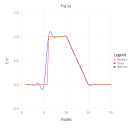
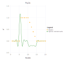
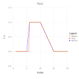

# Example Usage

## 1D interpolation case

Let's interpolate function ``f(x)``

```math
f(x) =
    \begin{cases}
       0 \, , &  1 \le x \lt 6 \\
       1 \, , &  6 \le x \le 10 \\
       -x/5 + 3 \, , &  6 \le x \le 15 \\
       0 \, , &  15 \le x \le 20 
    \end{cases}
```
by values of the function in nodes ``\{1, 2, 3, ..., 20\}`` (case A) and by values of the function and values of its first derivatives in the same nodes (case B). Firstly we'll build a spline using the reproducing kernel RK_H1():

```@meta
DocTestSetup = quote
    using Random
    using NormalHermiteSplines
end
```

A)

```@example A
    using NormalHermiteSplines

    x = collect(1.0:1.0:20)       # function nodes
    u = x.*0.0                    # function values in nodes
    for i in 6:10
        u[i] = 1.0
    end
    for i in 11:14
        u[i] = -0.2 * i + 3.0
    end
```

```@example A
    # An estimation of the 'scaling parameter' the spline being built with
    ε_estimation = estimate_epsilon(x, RK_H1())
```

```@example A
    # Build a differentiable spline by values of function in nodes
    # (a spline built with RK_H0 kernel is a continuous function,
    #  a spline built with RK_H1 kernel is a continuously differentiable function,
    #  a spline built with RK_H2 kernel is a twice continuously differentiable function).
    # Here value of the 'scaling parameter' ε is estimated in the interpolate procedure.
    spline = prepare(x, RK_H1())
    
    # A value of the 'scaling parameter' the spline was built with.
    ε = get_epsilon(spline)
```

```@example A
    # An estimation of the Gram matrix condition number
    cond = estimate_cond(spline)
```

```@example A
    # Construct the spline for given 'u' values
    spline = construct(spline, u)

    # An estimation of the interpolation accuracy -
    # number of significant digits in the function value interpolation result.
    significant_digits = estimate_accuracy(spline)
```

```@example A
    p = collect(1.0:0.2:20)        # evaluation points
    σ = evaluate(spline, p)
    σ = nothing                    # hide
```



```@example A
    dσ = similar(p)
    for i=1:length(p)
        dσ[i] = evaluate_derivative(spline, p[i])
    end
```



Evaluate the spline at some points:

```@example A
    p = [3.1, 8.1, 12.1, 18.1]
    σ = evaluate(spline, p)
```

Evaluate the spline derivatives at the same evaluation points:

```@example A
    dσ = similar(p)
    for i=1:length(p)
        dσ[i] = evaluate_derivative(spline, p[i])
    end
    dσ
```

Construct spline by different function values in nodes and evaluate new spline at the same evaluation points:

```@example A
    u2 = 2.0 .* u
    spline = construct(spline, u2)
    σ = evaluate(spline, p)
```

B)

```@example B
    using NormalHermiteSplines

    x = collect(1.0:1.0:20)       # function nodes
    u = x.*0.0                    # function values in nodes
    for i in 6:10
        u[i] = 1.0
    end
    for i in 11:14
        u[i] = -0.2 * i + 3.0
    end

    s = x                         # function first derivative nodes
    v = x.*0.0                    # function first derivative values
    for i in 11:14
        v[i] = -0.2
    end

    # Build a differentiable spline by values of function,
    # and values of its first derivatives in nodes
    # (a spline built with RK_H0 kernel is a continuous function,
    #  a spline built with RK_H1 kernel is a continuously differentiable function,
    #  a spline built with RK_H2 kernel is a twice continuously differentiable function).
    # Here value of the 'scaling parameter' ε is estimated in the interpolate procedure.
    spline = interpolate(x, u, s, v, RK_H1())

    # A value of the 'scaling parameter' the spline was built with
    ε = get_epsilon(spline)
```

```@example B
    # An estimation of the Gram matrix condition number
    cond = estimate_cond(spline)
```

```@example B
    # An estimation of the interpolation accuracy -
    # number of significant digits in the function value interpolation result.
    significant_digits = estimate_accuracy(spline)
```

```@example B
    p = collect(1.0:0.2:20)      # evaluation points
    σ = evaluate(spline, p)
    σ = nothing                  # hide
```


```@example B
    dσ = similar(p)
    for i=1:length(p)
        dσ[i] = evaluate_derivative(spline, p[i])
    end
```


Evaluate the spline at some points:

```@example B
    p = [3.1, 8.1, 12.1, 18.1]
    σ = evaluate(spline, p)
```

Evaluate the spline derivatives at the same evaluation points:

```@example B
    dσ = similar(p)
    for i=1:length(p)
        dσ[i] = evaluate_derivative(spline, p[i])
    end
    dσ
```

C) 

Now let's interpolate function ``f(x)`` using a spline built with reproducing kernel RK_H0:
```@example C
    using NormalHermiteSplines

    x = collect(1.0:1.0:20)       # function nodes
    u = x.*0.0                    # function values in nodes
    for i in 6:10
        u[i] = 1.0
    end
    for i in 11:14
        u[i] = -0.2 * i + 3.0
    end

    # Build a continuous spline by values of function in nodes
    # Here value of the 'scaling parameter' ε is estimated in the interpolate procedure.
    spline = interpolate(x, u, RK_H0())

    # A value of the 'scaling parameter' the spline was built with
    ε = get_epsilon(spline)
```

```@example C
    # An estimation of the Gram matrix condition number
    cond = estimate_cond(spline)
```

```@example C
    # An estimation of the interpolation accuracy -
    # number of significant digits in the function value interpolation result.
    significant_digits = estimate_accuracy(spline)
```

```@example C
    p = collect(1.0:0.2:20)        # evaluation points
    σ = evaluate(spline, p)
    σ = nothing                    # hide
```



Evaluate the spline at some points:

```@example C
    p = [3.1, 8.1, 12.1, 18.1]
    σ = evaluate(spline, p)
```

This spline is an infinitely differentiable function everywhere excepting the spline nodes. Its derivative does not exist at spline nodes but we can differentiate the spline at other points.
Let's evaluate the spline derivatives at the same evaluation points (which do not coincide with the spline nodes):

```@example C
    dσ = similar(p)
    for i=1:length(p)
        dσ[i] = evaluate_derivative(spline, p[i])
    end
    dσ
```

## 2D interpolation case

Let's interpolate function ``\phi (x,y)  = \frac{2}{3}cos(10x)sin(10y) + \frac{1}{3}sin(10xy)`` defined on unit square ``\Omega = [0,1]^2``.

```@raw html

``` ```@raw html

```  ```@raw html

```
We built a spline using function ``\phi`` values sampled on set of 100 pseudo-random nodes uniformly distributed on ``\Omega`` (case A).

Spline plot                                                                        Approximation error plots

```@raw html

``` ```@raw html

```  ```@raw html

```
and 

using function ``\phi`` values sampled on set of 100 pseudo-random nodes uniformly distributed on ``\Omega`` and 80 function ``\phi`` gradient values defined at nodes located on the border of domain ``\Omega`` (case B):

```@raw html
 
```
here red dots represent the function ``\phi`` gradient nodes. 

Spline plot                                                                         Approximation error plots

```@raw html

``` ```@raw html

```  ```@raw html

```
Following is the code example for case A:

```@example 2A
    using Random
    using NormalHermiteSplines

    # generating 100 uniform random nodes
    m = 100
    nodes = Matrix{Float64}(undef, 2, m)
    rng = MersenneTwister(0);
    rnd = rand(rng, Float64, (2, m))
    for i = 1:m
        nodes[1, i] = rnd[1, i]
        nodes[2, i] = rnd[2, i]
    end

    u = Vector{Float64}(undef, m)     # function values at nodes
    for i = 1:m
        x = nodes[1,i]
        y = nodes[2,i]
        u[i] = (2.0*cos(10.0*x)*sin(10.0*y) + sin(10.0*x*y))/3.0
    end

    # creating the uniform Cartesian grid of size 101x101 on [0, 1]x[0, 1]
    t = 100
    x = collect(range(0.0, 1.0; step = 1.0/t))
    y = collect(range(0.0, 1.0; step = 1.0/t))

    t1 = t + 1
    n = t1^2
    grid = Matrix{Float64}(undef, 2, n)
    for i = 1:t1
        for j = 1:t1
            r = (i - 1) * t1 + j
            grid[1, r] = x[i]
            grid[2, r] = y[j]
        end
    end

    f = Vector{Float64}(undef, n)
    for i = 1:n
        x = grid[1,i]
        y = grid[2,i]
        f[i] = (2.0*cos(10.0*x)*sin(10.0*y) + sin(10.0*x*y))/3.0
    end

    # Here spline is constructed with RK_H2 kernel,
    # the value of the 'scaling parameter' ε is estimated
    # in the interpolate procedure.
    rk = RK_H2()
    spline = interpolate(nodes, u, rk)
    #
    # A value of the 'scaling parameter' the spline was built with
    ε = get_epsilon(spline)
```

```@example 2A
    # An estimation of the Gram matrix condition number
    cond = estimate_cond(spline)
```

```@example 2A
    # An estimation of the interpolation accuracy -
    # number of significant digits in the function value interpolation result.
    significant_digits = estimate_accuracy(spline)
```

```@example 2A
    σ = evaluate(spline, grid)
    # Return the Root Mean Square Error (RMSE) of interpolation
    rmse = sqrt(sum((f .- σ).^2)) / sqrt(length(f))
```

```@example 2A
   # Return the Maximum Absolute Error (MAE) of interpolation
   mae = maximum(abs.(f .- σ))
```

Value of function ``\phi`` at evaluation point ``p = [0.5; 0.5]``
```@example 2A
    p = [0.5; 0.5]
    x = p[1]
    y = p[2]
    f = (2.0*cos(10.0*x)*sin(10.0*y) + sin(10.0*x*y))/3.0
```

Value of spline at the evaluation point:
```@example 2A
    σ = evaluate_one(spline, p)
```

Difference of function ``\phi`` and spline values at the evaluation point:
```@example 2A
    diff = f - σ
```

Gradient of function ``\phi`` at the evaluation point
```@example 2A
    g1 = (10.0*y*cos(10.0*x*y) - 20.0*sin(10.0*x)*sin(10.0*y))/3.0
    g2 = (20.0*cos(10.0*x)*cos(10.0*y) + 10.0*x*cos(10.0*x*y))/3.0 
    f_grad = [g1; g2]
```

Gradient of spline at the evaluation point
```@example 2A
    σ_grad = evaluate_gradient(spline, p)
```

Norm of difference of function ``\phi`` and spline gradient values at the evaluation point:
```@example 2A
    diff_grad = sqrt(sum((f_grad .- σ_grad).^2))
```

Corresponding code example for case B:

```@example 2B
    using Random
    using NormalHermiteSplines

    function get_2D_border_nodes(m::Int)
        mat0 = [0.0 0.0; 0.0 1.0; 1.0 0.0; 1.0 1.0]'
        if m < 1
            return mat0
        end
        m1 = m + 1
        p = collect(range(1.0/m1, (1.0 - 1.0/m1); step = 1.0/m1))
        ms = m * 4
        mat = Matrix{Float64}(undef, 2, ms)
        for i = 1:m
            mat[1,i] = 0.0
            mat[2,i] = p[i]
        end
        for i = (m+1):(2*m)
            mat[1,i] = 1.0
            mat[2,i] = p[i-m]
        end
        for i = (2*m+1):(3*m)
            mat[1,i] = p[i-2*m]
            mat[2,i] = 0.0
        end
        for i = (3*m+1):(4*m)
            mat[1,i] = p[i-3*m]
            mat[2,i] = 1.0
        end
        w = hcat(mat0, mat)
        return w
    end

    # generating 100 uniform random nodes
    m = 100
    nodes = Matrix{Float64}(undef, 2, m)
    rng = MersenneTwister(0);
    rnd = rand(rng, Float64, (2, m))
    for i = 1:m
        nodes[1, i] = rnd[1, i]
        nodes[2, i] = rnd[2, i]
    end

    u = Vector{Float64}(undef, m)     # function values at nodes
    for i = 1:m
        x = nodes[1,i]
        y = nodes[2,i]
        u[i] = (2.0*cos(10.0*x)*sin(10.0*y) + sin(10.0*x*y))/3.0
    end

    bnodes = get_2D_border_nodes(19)   # 80 border nodes 
    bn_1 = size(bnodes, 2)
    d_nodes = Matrix{Float64}(undef, 2, bn_1)
    es = Matrix{Float64}(undef, 2, bn_1)
    du = Vector{Float64}(undef, bn_1)
    grad = [0.0; 0.0]
    for i = 1:bn_1
        x = bnodes[1,i]
        y = bnodes[2,i]
        d_nodes[1,i] = x
        d_nodes[2,i] = y
        grad[1] = (10.0*y*cos(10.0*x*y) - 20.0*sin(10.0*x)*sin(10.0*y))/3.0
        grad[2] = (20.0*cos(10.0*x)*cos(10.0*y) + 10.0*x*cos(10.0*x*y))/3.0
        es[1,i] = grad[1]            # no need to normalize 'es' vectors
        es[2,i] = grad[2]
        du[i] = sqrt(grad[1]^2 + grad[2]^2)
    end

    # creating the uniform Cartesian grid of size 101x101 on [0, 1]x[0, 1]
    t = 100
    x = collect(range(0.0, 1.0; step = 1.0/t))
    y = collect(range(0.0, 1.0; step = 1.0/t))

    t1 = t + 1
    n = t1^2
    grid = Matrix{Float64}(undef, 2, n)
    for i = 1:t1
        for j = 1:t1
            r = (i - 1) * t1 + j
            grid[1, r] = x[i]
            grid[2, r] = y[j]
        end
    end

    f = Vector{Float64}(undef, n)
    for i = 1:n
        x = grid[1,i]
        y = grid[2,i]
        f[i] = (2.0*cos(10.0*x)*sin(10.0*y) + sin(10.0*x*y))/3.0
    end

    # Here spline is constructed with RK_H2 kernel,
    # the 'scaling parameter' ε is defined explicitly.
    rk = RK_H2(1.0)
    spline = interpolate(nodes, u, d_nodes, es, du, rk)
    #
    # A value of the 'scaling parameter' the spline was built with
    ε = get_epsilon(spline)
```

```@example 2B
    # An estimation of the Gram matrix condition number
    cond = estimate_cond(spline)
```

```@example 2B
    # An estimation of the interpolation accuracy -
    # number of significant digits in the function value interpolation result.
    significant_digits = estimate_accuracy(spline)
```

```@example 2B
    σ = evaluate(spline, grid)
    # Return the Root Mean Square Error (RMSE) of interpolation
    rmse = sqrt(sum((f .- σ).^2)) / sqrt(length(f))
```

```@example 2B
   # Return the Maximum Absolute Error (MAE) of interpolation
   mae = maximum(abs.(f .- σ))
```

Value of function ``\phi`` at evaluation point ``p = [0.5; 0.5]``
```@example 2B
    p = [0.5; 0.5]
    x = p[1]
    y = p[2]
    f = (2.0*cos(10.0*x)*sin(10.0*y) + sin(10.0*x*y))/3.0
```

Value of spline at the evaluation point:
```@example 2B
    σ = evaluate_one(spline, p)
```

Difference of function ``\phi`` and spline values at the evaluation point:
```@example 2B
    diff = f - σ
```

Gradient of function ``\phi`` at the evaluation point
```@example 2B
    g1 = (10.0*y*cos(10.0*x*y) - 20.0*sin(10.0*x)*sin(10.0*y))/3.0
    g2 = (20.0*cos(10.0*x)*cos(10.0*y) + 10.0*x*cos(10.0*x*y))/3.0 
    f_grad = [g1; g2]
```

Gradient of spline at the evaluation point
```@example 2B
    σ_grad = evaluate_gradient(spline, p)
```

Norm of difference of function ``\phi`` and spline gradient values at the evaluation point:
```@example 2B
    diff_grad = sqrt(sum((f_grad .- σ_grad).^2))
```

## Q & A

Q1. *Question*: The call

```julia
spline = interpolate(x, u, RK_H2())
```
cause the following error: `PosDefException: matrix is not positive definite; Cholesky factorization failed.` What is a reason of the error and how to resolve it?

A1. *Answer*: Creating a Bessel potential space reproducing kernel object with omitted scaling parameter `ε` means that this parameter will be estimated during interpolating procedure execution. It might happen that estimated value of the `ε` is too small and corresponding  Gram matrix of the system of linear equations which defines the normal spline coefficients is a very ill-conditioned one and it lost its positive definiteness property because of floating-point rounding errors.  

There are two ways to fix it.

- We can get the estimated value of the parameter `ε` by calling `get_epsilon` function:
```julia
ε = get_epsilon(spline)
``` 
then we can call the `interpolate` function with a larger value of this parameter:
```julia
larger_ε = 5.0*ε
spline = interpolate(x, u, RK_H2(larger_ε))
```

- We may change the precision of floating point calculations. Namely, it is possible to use Julia standard BigFloat numbers or Double64 - extended precision float type from the package [DoubleFloats](https://github.com/JuliaMath/DoubleFloats.jl):
```julia
using DoubleFloats

x = Double64.(x)
u = Double64.(u)
ε = Double64(1.0)
spline = interpolate(x, u, RK_H2(ε))
```
This answer also applies to reproducing kernel object of type `RK_H0` or `RK_H1`.

Q2. *Question*: The following calls

```julia
spline = interpolate(x, u, RK_H2())
σ = evaluate(spline, p)
```
produce the output which is not quite satisfactoty.
Is it possible to improve the quality of interpolation?

A2. *Answer*: Creating a Bessel potential space reproducing kernel object with omitted scaling parameter `ε` means that this parameter will be estimated during interpolating procedure execution. It might happen that estimated value of the `ε` is too large and it is possible to use a smaller value of `ε` which can lead to a better quality of interpolation. 
- We can get the value of scaling parameter `ε` by calling `get_epsilon` function
```julia
ε = get_epsilon(spline)
```
and get an estimation of the problem's Gram matrix condition number by calling `estimate_cond` function as well as an estimation of the number of the significant digits in the interpolation result by calling `estimate_accuracy` function:
```julia
cond = estimate_cond(spline)
significant_digits = estimate_accuracy(spline)
```
In a case when estimated number of the significant digits is bigger than 10 and estimated condition number is not very large, i.e. it is less than ``10^{12}``, we may attempt to build a better interpolating spline by calling `interpolate` function with a smaller value of the scaling parameter:
```julia
e_smaller = ε/2.0 
spline = interpolate(x, u, RK_H2(e_smaller))
cond = estimate_cond(spline)
significant_digits = estimate_accuracy(spline)
σ = evaluate(spline, p)
```
Taking into account new `cond` and `significant_digits` values we decide of making further correction of the scaling parameter.

 For further information, see [Selecting a good value of the scaling parameter](https://igorkohan.github.io/NormalHermiteSplines.jl/stable/Parameter-Choice/).

